_Nous venons de recevoir notre troisième box HelloFresh ce week-end. Après deux semaines complètes de repas made in HelloFresh, on voulait vous expliquer pourquoi ce concept est “testé et approuvé” chez nous, et vous permettre à votre tour de tester grâce à [ce code promo](https://www.hellofresh.nl?c=CLMTAI&utm_source=raf-share&utm_medium=referral&utm_campaign=clipboard) offrant 25€ sur votre première box !_

---

J’aime cuisiner. J’aime aussi, le week-end, passer du temps sur Pinterest à éplucher les idées de recettes et préparer les menus de la semaine. J’ai toujours envie de tester plein de nouvelles choses et de préparer des bons petits plats le soir. Le problème, c’est qu’Alexis il n’aime pas trop les recettes. Non qu’il n’aime pas cuisiner, c’est surtout le temps passé en cuisine qui l’embête à chaque fois. À l’écouter, ce serait omelette-champignons-fromage tous les soirs : simple, rapide et efficace mais tout même gourmand.

Du coup, le choix des menus a souvent été un petit casse-tête chez nous :

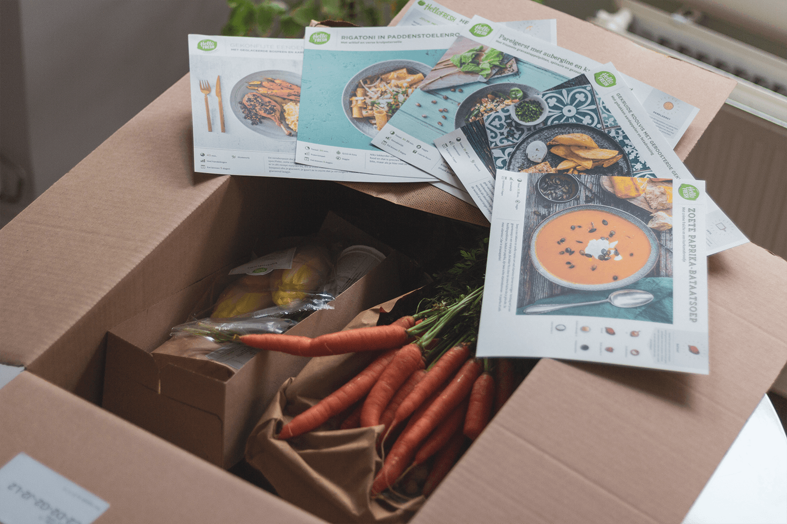

## Hello Fresh : La box Original pendant deux semaines.

Pour notre première box, nous avons choisi la box “Original” pour 5 repas de 3 personnes. Cela nous permettait :

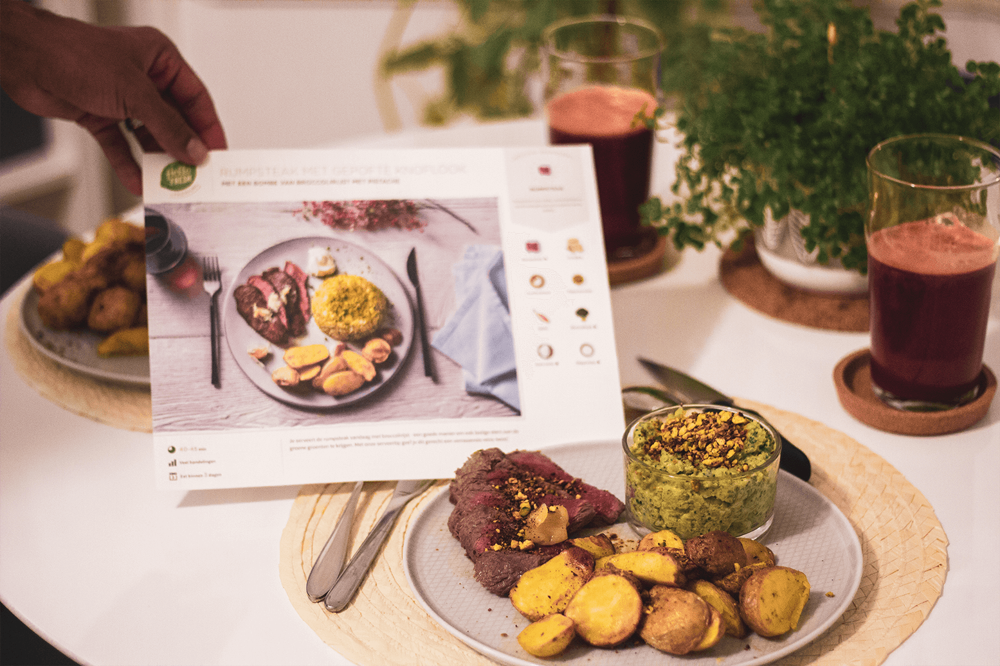
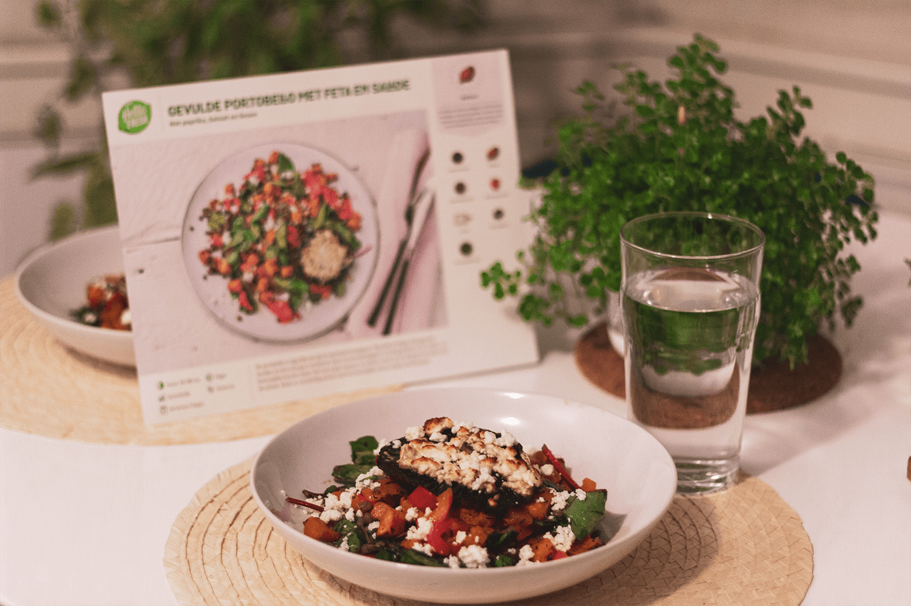

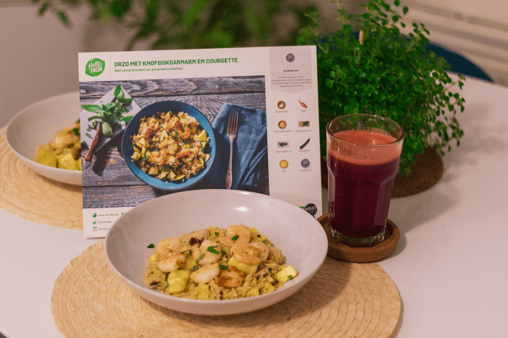
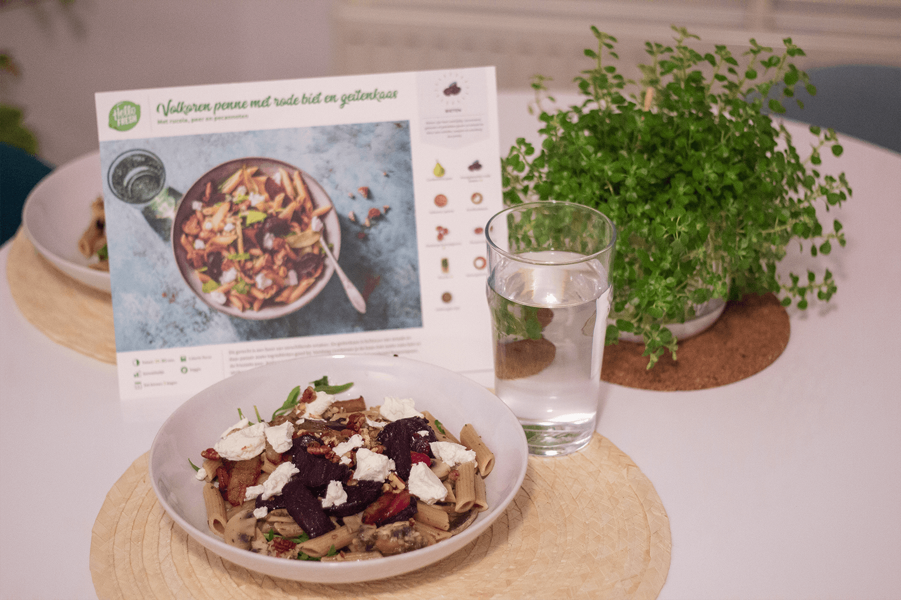

_Semaine 2_

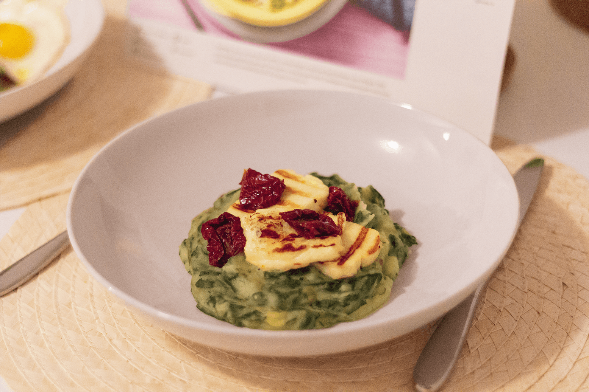

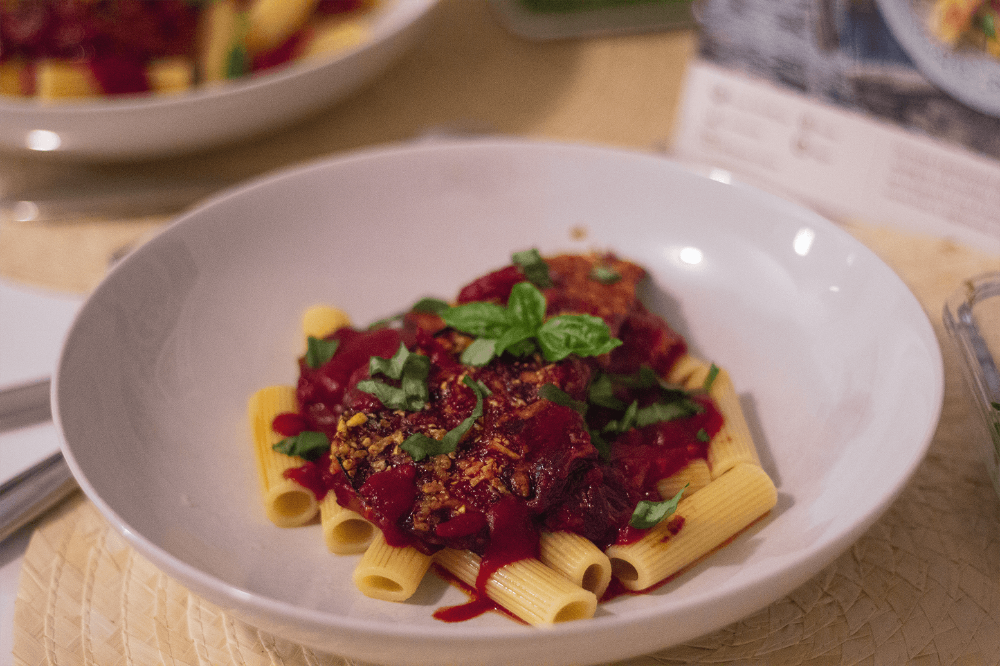
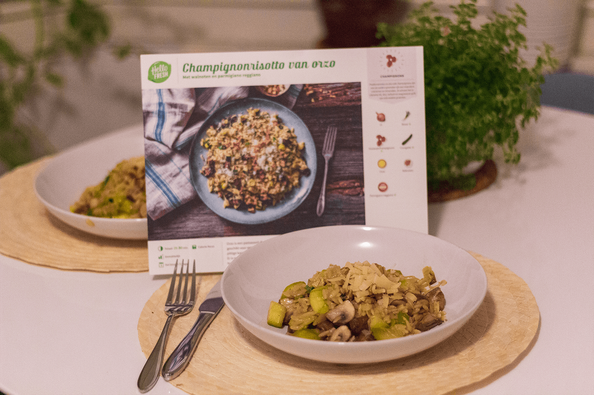
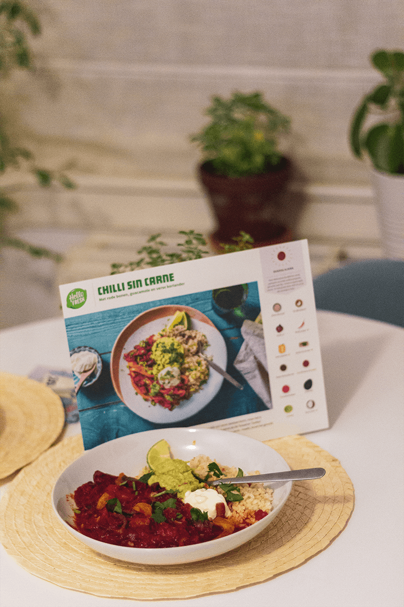

## Notre avis HelloFresh : On adore

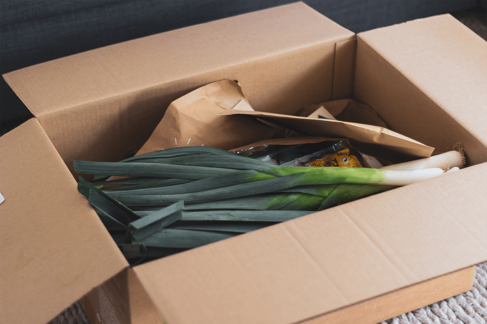
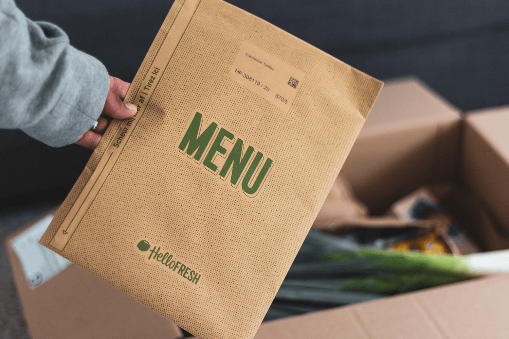

## Notre avis Hello Fresh : On aime moins

- Qui dit livraison, dit emballages. C’est le point noir de cette box. Pour autant, on voit qu’HelloFresh fait un gros effort vis-à-vis de cela. Hormis les herbes fraiches et certains légumes (emballés du plastique comme dans un supermarché), tout est dans du carton recyclé. Ça reste pourtant de l’emballage “facultatif”. 

- Les fiches recettes sont jolies et pratiques, mais recevoir chaque semaine 5-6 feuilles cartonnées, imprimées alors qu’il est possible d’avoir les recettes sur l’application .. C’est dommage je trouve.

- Les produits sont d’une grande qualité, mais rien n’indique nécessairement que ce soit des produits bio ou locaux. Pour compenser, nous essayons d’aller au marché chaque semaine pour nos fruits et légumes du petit-déjeuner et les jus de légumes maisons.

- Le petit cadeau en plus à chaque box. C’est gentil de la part de HelloFresh, mais comme chaque repas est prévu “à la lettre” et bien, cet ingrédient bonus est un peu .. inutile. Par exemple, nous avons eu un pot de moutarde au miel et du riz basmati. Nous n'avons encore aucune idée de quand nous allons les consommer. Il parait qu’au bout de 6 semaines, l'ingrédient bonus est une viande à cuisiner au four ! À voir donc.

- Hello Fresh n’est malheureusement pas (plus) disponible dans toute la France, mais seulement dans le Nord et le Pas de Calais.

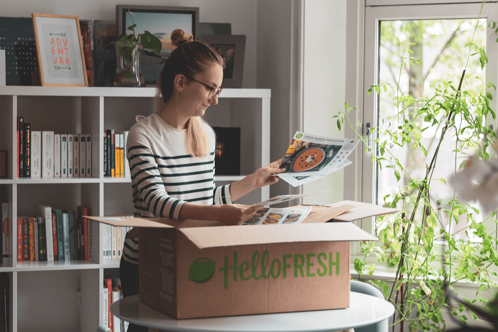

## Notre avis Hello Fresh : en conclusion

En bref, nous sommes vraiment **convaincus par le concept** et nous en sommes déjà à notre troisième box, malgré quelques points d’amélioration.

Pour notre style de vie aux journées relativement bien remplies, c’est clairement un gain de temps considérable pour nous ! À voir si, dans le temps, les recettes sont réellement de saison et se renouvellent régulièrement.

Pour l’instant, nous sommes convaincus. À l’avenir, on aimerait bien trouver une box similaire, mais proposant uniquement des produits frais, de saison et locaux ! Nous aimerions bien aussi tester leur box fruits, et pourquoi pas une fois de temps en temps les desserts et les petits-déjeuner !

Comme on est vraiment fan du concept, on vous propose vous aussi de tester et découvrir HelloFresh en vous offrant **25 € sur votre première box**, quelque soit, grâce à notre [code promo](https://www.hellofresh.nl?c=CLMTAI&utm_source=raf-share&utm_medium=referral&utm_campaign=clipboard). _(En toute transparence, pour toute première commande passée avec ce code, nous recevrons aussi 25 €)_

On vous souhaite une belle semaine. Je file en cuisine préparer les cuisses de canard confites et raisins secs avec des carottes glacées et une purée de pommes de terre 😉

À dimanche prochain !
