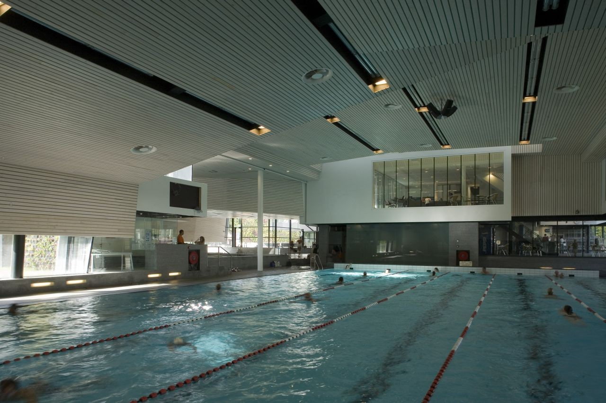
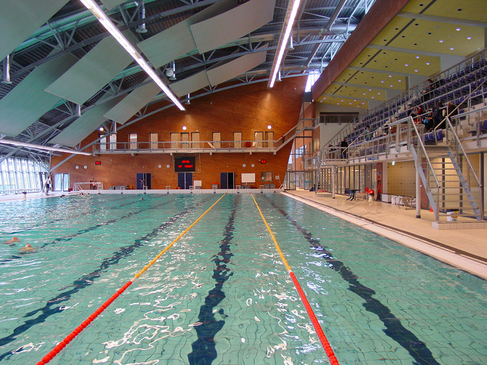
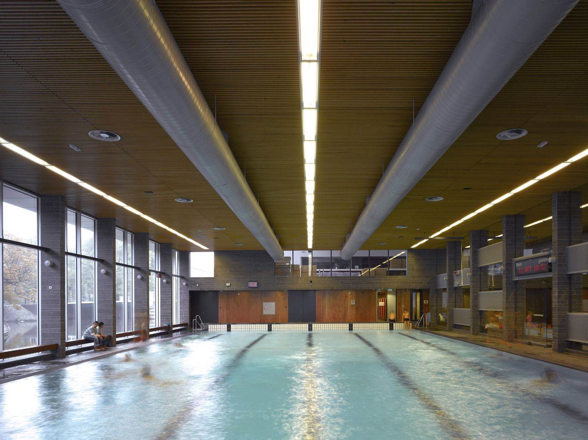

_Dernièrement, nous avons testé 4 piscines à Amsterdam. Pour vous aider à trouver celle qui vous convienne le mieux, nous avons, depuis fin septembre, mouillé le maillot pour vous. Grand nageur papillon ou simple adepte de la brasse, voici le récit de notre plongée dans les grands bains amstellodamois._

—

Parmi nos bonnes résolutions prise mais jamais bien tenues, il y avait la piscine. Nous avions acheté tout l’équipement nécessaire à Décathlon (oui, Décathlon existe aux Pays-Bas) ; lunettes, maillots de bain, bonnets, mais ... autant vous dire que nos affaires sont encore bien neuves !

On a finalement réalisé à quel point il pouvait être difficile d’aller à la piscine, encore plus dans une ville étrangère où toutes les informations sont en néerlandais avant-tout. On s’est dit que l’on n'était sûrement pas les seuls à faire face à ce problème et que c’était l’occasion de partager notre expérience avec vous.

Après presque deux ans sans piscine, nous avons décidé de nous “remettre à l’eau”, pris notre courage à deux mains, et finalement décidé d’aller tester les piscines les plus proches de chez nous. Par proche, j’entends moins de 20 minutes à vélo. Nous avons donc testé les 4 piscines suivantes : **Sport Plaza Mercator** à Amsterdam West, **Zuiderbad** à Museumplein, **Het Marnix** dans le Jordaan et enfin **Sloterparkbad** à Slotervaart.

## Remarques générales

_Les piscines en France VS Les piscines aux Pays-Bas_

Tout d'abord, il existe quelques différences notables entre ce que nous avons l’habitude de voir en France et aux Pays-Bas, qu’il nous semblait important de préciser afin d'éviter toute mauvaise surprise.

\- Le concept de pédiluve n’existe pas. Je sais que cela peut parfois faire débat en France. Ici, aux Pays-bas, la question ne se pose même pas. Il n’y a pas non plus de “zone de déchausse” obligatoire. Vous pouvez vous balader en chaussure jusqu’aux douches ou presque sans que personnes ne vous disent quoique ce soit. De fait, tout le monde, ou presque, marche en tongue autour de la piscine.

\- Le bonnet de bain n’est pas obligatoire. Le short de bain n’est pas interdit non plus. Les normes d’hygiène sont légèrement différentes. Non pas que les piscines soient moins propres, simplement les restrictions sont moindres, les libertés plus grandes, comme un peu partout aux Pays-Bas.

\- Toutes les douches et cabines sont mixtes. Personnellement, on trouve ça pratique, surtout lorsque vous venez nager en groupe, en famille ou, comme nous, en couple !

\- Enfin, les horaires fonctionnent un peu différemment de ce que l’on peut avoir l’habitude en France. Ce ne sont pas des horaires d’ouvertures fixes et en continue, mais bien des créneaux horaires, alternant entre “nage”, “récréatif” et “leçon”. Il faut donc bien prévoir le coup au risque de soit ne pas pouvoir nager, soit nager sans ligne d’eau au milieu d’enfants et parents.

## Piscines Amsterdam : Sport Plaza Mercator

### Emplacement

Sport Plaza Mercator se situe à Amsterdam-West, à la bordure du Rembrandtpark. Cette piscine est très facilement accessible depuis le centre à vélo et en transport en commun via le tram 13 ou le bus 15.

[Voir sur la carte](https://goo.gl/maps/TXUd4Uoyx9n)

### Infrastructures & bassins

Sport Plaza Mercator est un grand centre sportif comprenant non seulement une piscine, mais aussi une salle de fitness ainsi qu’un solarium, un sauna et un hamac. Il est aussi possible de se restaurer sur place après ou avant l’effort. Côté piscine, trois bassins sont à disposition : un bassin 8 lignes de 25 mètres à l'intérieur, un bassin extérieur de 25 mètres non chauffé ainsi qu’un troisième bassin peu profond dit “thérapeutique”. À noté : le fond du bassin 25m est réglable ce qui le rend très polyvalent (compétition, water-polo, classes, disco, ...).

La température de l'eau de grand bassin est de 27,5 degrés en moyenne.

### Horaires & Tarifs

- Prix à l’unité : 5,70€
- Prix d’une carte 12 entrées : 57 € soit 4,75€ / entrée

_Horaires de nage (hors événements et vacances scolaires) :_

- En semaine, le mardi & jeudi
  - 07:00-11:00

- Samedi

  - 12:00 - 13:00

- Dimanche
  - 09:00 — 11:00

Pour plus d’horaires, rdv ici : [https://www.sportplazamercator.nl/tijden](https://www.sportplazamercator.nl/tijden)

### Propreté / Entretien

De manière globale, nous avons trouvé le sol de piscine tout comme l’eau du grand bassin relativement propre. Les douches sont bien chaudes !
Les infrastructures restent bien entretenues.

[Site web](https://www.sportplazamercator.nl/)

### Notre avis général — 4/5

Cette piscine fut la première que nous avons testée sur Amsterdam. Nous avions quelques appréhensions et ne savions pas trop à quoi nous attendre. Hormis la surprise du pédiluve et des shorts de bains autorisé, cela reste une piscine tout à fait normale. Il y a plusieurs lignes de nage, avec des vitesses de nages différentes. Il est possible de ramener son matériel et ses palmes sans soucis. Nous y sommes allés un dimanche matin, moins d'une heure avant la fin du créneau horaire et c’était très fréquenté ! Les lignes d’eau étaient remplies et nous devions “faire la queue” entre deux longueurs pour ne pas de prendre les pieds du voisin en nageant. Nous n’avons pas testé les parties “détentes” avec le ham,am et le sauna, mais une de mes collègues m’en a dit beaucoup de bien. L’accès est inclus avec le ticket d’entrée.

C’est l’une des piscines les plus proches de la maison, mais dû aux horaires un peu restrictif, pas sûre que nous y retournerons souvent.

## Piscines Amsterdam : Zuiderbad

### Emplacement

Zuiderbad est situé à quelques bas de Museumplein et du Rijskmuseum. Un emplacement très central est accessible depuis de nombreux transports en commun.

[Voir sur la carte](https://goo.gl/maps/LBxagJtMr3N2)

### Infrastructures & bassins

Cette piscine fut construite dans un bâtiment historique datant de 1897. Bien que rénové depuis, la piscine a gardé en très grande partie son aspect rétro et l’architecture d’origine. Ici , vous ne trouverez qu’un seul bassin couvert de 25 mètres. Il est également possible, moyennant supplément, d’utiliser les baignoires à remous en bord de piscine ou bien les bains turcs. La piscine possède un toboggan et des parties à “remous”.

La température de l’eau est de 28 degrés environ.

### Horaires & Tarifs

- Prix à l’unité : 3,75€
- Prix d’une carte 12 entrées : 37,70 € soit 3,11€ / entrée
- Prix d’une carte 25 entrées : 74,65 € soit 2,99€ / entrée
- Prix d’une carte 50 entrées : 130,60 € soit 2,61€ / entrée

_Horaires de nage (hors événements et vacances scolaires) :_

- En semaine du lundi au vendredi
  - 07:00-09:00

- Samedi
  - 08:00 - 15:15

- Dimanche
  - 13:00 — 15:15

_Ces créneaux horaires étant tous “partagés”_

Plus d’horaires ici [https://www.amsterdam.nl/zuiderbad/openingstijden/](https://www.amsterdam.nl/zuiderbad/openingstijden/)

Achat de tickets en ligne : [https://webshopzuiderbad.recreatex.be/](https://webshopzuiderbad.recreatex.be/)

### Propreté / Entretien

Peut mieux faire.. On était content d’avoir nos claquettes pour marcher jusqu’aux douches.

[Site web](https://www.amsterdam.nl/zuiderbad/)

### Notre avis général — 3/5

Cette piscine vaut le détour ne serait-ce que pour le bâtiment et le côté rétro, très années 1920, avec les cabines-maisonnettes en bois jaune, longeant le grand bassin de chaque côté. De plus, cette piscine Municipale, est l’une des mois chère (aux prix à l’unité) que nous ayons testé dans Amsterdam. Mais, attention, grand nageur et même amateur, passez votre chemin. Le bassin, annoncé de 25 mètres et en réalité coupé au tier avec d’un côté le “récréatif” et de l’autre, deux petites lignes de nages, devant faire à peine 20 mètres de longueur. Ce n’est vraiment, vraiment pas une piscine faite pour la nage et l’entraînement à proprement parlé. Le seul avantage reste que l’eau est très chaude comparée à un bassin de nage traditionnel ! À tester une fois, pour le fun, et puis c’est tout 🙂

## Piscines Amsterdam : Sloterparkbad

### Emplacement

Cette piscine est plus excentrée du centre, puisque située à l’extérieur du ring, dans le quartier de Amsterdam Nieuwe-west — Slotermeer. Elle a vue sur le lac de Sloterplas. Le tram 7 s’arrête à proximité de la piscine.

[Voir sur la carte](https://goo.gl/maps/yXLd5y39BAF2)

### Infrastructures & bassins

Ici encore, ce n’est pas une simple piscine, mais bien l'un des plus grands complexes sportifs de natation des Pays-bas, construit en 2001. Ce centre est conçu pour la compétition et accueille régulièrement plusieurs championnats de natation.
Sloterparkbad dispose de 5 bassin au total :

- Un grand de 50 mètres, divisible en deux parties de 25 mètres.
- Une piscine de 20 mètres avec fond amovible pour les cours de natations
- Une piscine extérieure de 25 mètres
- Un bassin de saut, profond 5 mètres (non ouvert au public)
- Et enfin, une grande zone dit “récréative” et de loisir pour les familles et les enfants.

La température de l'eau du bassin de 50 mètres est d'environ 27 degrés.

### Horaires & Tarifs

- Prix à l’unité : 3,85€
- Prix d’une carte 12 entrées : 38,5€ soit 3,21€ / entrée
- Prix d’une carte 25 entrées : 77€ soit 3,08€ / entrée
- Pass annuel: 209,75€

_Horaires de nage (hors événements et vacances scolaires) :_

- En semaine du lundi au vendredi
  - 06:30-08:00 — 50m

- Samedi
  - 10:15 - 12:15 — 25m

- Dimanche
  - 09:00 - 12:00 — 50m

### Propreté / Entretien

Malgré la taille imposante de la piscine et sa fréquentation, l’eau reste relativement propre. J’ai quand même aperçu plusieurs chouchous au fond de l’eau avec que des morceaux de feuille ... Les vestiaires et les cabines d’essayage sont très corrects ; les douches bien chaudes.

[Site web](https://www.optisport.nl/sloterparkbad)

### Notre avis général 4,5/5

Cette piscine et LA piscine pour s’entraîner. C’était une première pour nous, le bassin de 50 mètres. Une fois l’appréhension de la longueur passée, on se rend compte que nager de 50 mètres en 50 mètres c’est quand même plus rapide que dans un bassin de 25 mètres ! Ce dernier est suffisamment grand pour ne pas se nager dessus. Nous n’avons pas testé mais il est possible d’emprunter du matériel. Mon seul point négatif reste, personnellement, la température de l’eau. 27 degrés ça reste bien frais en entrant dans l’eau et ça oblige à se bouger les fesses pour se réchauffer ! De plus, l’entrée, que ce soit à l’unité ou bien en carte, reste l’une des piscines les moins chères que nous ayons testé jusqu’ici.

Alexis est vraiment fan de cette piscine ; cette dernière se situant à 16 min à vélo de la maison, je pense que nous y retournerons assez régulièrement.

## Piscines Amsterdam : Het Marnix

### Emplacement

Het Marnix, complexe sportif, se situe dans le Jordaan, à proximité du Noordermarkt et de Marnixstraat. Le lieu est donc super accessible que cela soit à vélo, en tram ou voir même à pied, pour ceux habitant dans le centre.

[Voir sur la carte](https://goo.gl/maps/xA1SpWn3sLv)

### Infrastructures & bassins

Het Marnix dispose de deux bassins : un premier de 25 mètres avec vue sur le Singelgracht, un second de 20 mètres, moins profond pour l’apprentissage et le récréatif.

L’eau du grand bassin est à 28 degrés environ.

_À noté que le lieu est aussi doté d’une salle de sport à l’étage et de salles de réunion ainsi que d’un terrain multisports pouvant accueillir des club de volleyball - handball - badminton - tennis etc..._

### Horaires & Tarifs

- Prix à l’unité : 5,10€
- Prix d’une carte 12 entrées : 51€ soit 4,25€ / entrée
- Prix d’une carte 25 entrées : 77€ soit 3,08€ / entrée
- Pass 3 mois: 97,50€

_Horaires de nage (hors événements et vacances scolaires) :_

- En semaine du lundi au vendredi
  - de 07:00 à 09:00

- Samedi
  - 07:00-09:15
  - 13:15-14:45
  - 17:45-20:00

- Dimanche
  - 07:00-12:00
  - 13:00-17:00
  - 18:00-20:00

### Propreté / Entretien

Les lieux sont très propres et les bâtiments modernes très bien entretenus.

[Site web](https://hetmarnix.nl/)

### Notre avis général 4.5/5

Malgré un tarif à l’unité un peu élevé, cette piscine fait partie des plus agréables que nous ayons testées jusqu’ici. Nous y sommes aller un dimanche, en pleine après-midi et nous avons même eu le luxe d’avoir une ligne d’eau entière rien que pour nous deux.
L’amplitude horaire est appréciable comparée aux piscines précédentes, surtout le dimanche, où l’on aime parfois prendre le temps de faire les choses sans devoir se lever aux aurores ! C’est simplement dommage que ce soit la plus éloignée de la maison. Si vous habitez dans le quartier, on recommande vivement !

---

#### Bonus — On n'a pas testé personnellement, mais entendu beaucoup de bien

- **[Mirandabad](https://www.amsterdam.nl/demirandabad/)** — Dans le Pijp
- **[SwimGym](https://swimgym.nl/)** — Vers l’Amstel, le CrossFit version piscine avec le SOTD “swim of the day »

---

On espère que ce petit guide vous a aiguillé dans votre quête de la piscine parfaite à Amsterdam. On essaiera de tenir l’article à jour, d’un point de vu horaires et tarifs. Si vous avez testé des piscines n’apparaissant pas dans la liste ci-dessus, n’hésitez pas à partager vos retours d’expériences en commentaires, et qui sait, nous irons peut-être les tester à notre tour un de ces quatre.

S’il est vrais que les normes de propreté et le fonctionnement peut parfois surprendre, cela reste des piscines telles que nous les connaissons en France.

Et sinon, de notre côté, on est content de se tenir enfin à cette bonne résolution. Voilà plus de 5 semaines d’affilées que nous allons nager 30-40 min le week-end. D’ailleurs ce dimanche, on a même nagé 1000m (1km!) ce qui pour moi, qui détestais la piscine à l’école, représente un énorme exploit. Prochaine étape : affiner un peu sa technique et nager un crawl “correct” 🙈

Enfin, si, comme nous, vous avez un peu peur de vous rendre à la piscine, l’appréhension du lieu inconnue, etc.. Proposez à un collègue ou un ami(e) de venir avec vous, parce que À Deux, C’est (toujours) Mieux 😉

_Belle semaine et **bonne nage** !_
